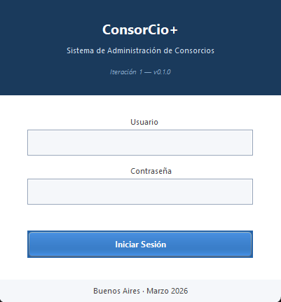
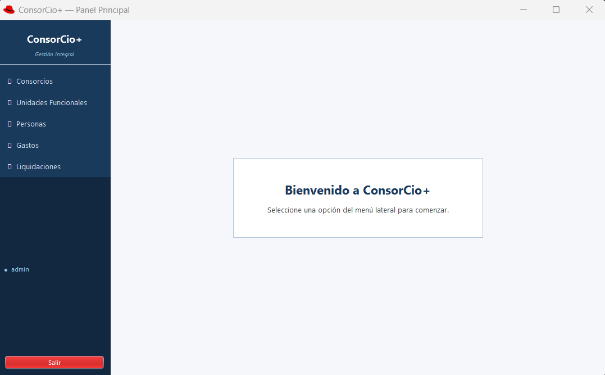

# ConsorCio+ — Sistema de Gestión de Administración de Consorcio

**Seminario de Práctica Informática — Módulo 1: Definición del Proyecto**  
**Alumno:** Flavio Pérez  
**Fecha:** Marzo 2026  
**Metodología:** Proceso Unificado de Desarrollo (PUD)

---

## Introducción

La administración de consorcios en Argentina es una actividad de alta complejidad operativa. Los administradores gestionan simultáneamente múltiples edificios, debiendo controlar cobros de expensas, aplicación de intereses por mora, registro de gastos y atención de reclamos de vecinos.

Hoy en día, gran parte de estos procesos se llevan a cabo con **planillas de cálculo (Excel)** o cuadernos físicos, herramientas que no contemplan las particularidades normativas de la propiedad horizontal (Ley 13.512 y Código Civil y Comercial, art. 2048).

**ConsorCio+** es una aplicación de escritorio desarrollada íntegramente en Java SE, orientada a resolver esta problemática de forma estructurada, segura y escalable.

---

## Justificación

La solución propuesta se fundamenta en tres dimensiones:

1. **Problemática detectada:**
   - Errores de cálculo en la distribución de gastos por porcentual.
   - Falta de trazabilidad en pagos parciales y moras.
   - Reclamos de vecinos sin seguimiento formal.
   - Imposibilidad de obtener reportes financieros reales.

2. **Beneficios esperados:**
   - Automatización del cálculo de liquidaciones mensuales.
   - Generación automática de recibos numerados.
   - Control de mora y aplicación de intereses sin intervención manual.
   - Seguimiento del ciclo de vida de reclamos de mantenimiento.

3. **Viabilidad técnica:**
   - Stack 100% open-source: Java SE, MySQL/MariaDB, JDBC.
   - No requiere infraestructura adicional más allá de una PC con JVM.

---

## Definiciones del Proyecto y del Sistema

**Título:** ConsorCio+ — Sistema de Gestión Integral para Administradores de Consorcio

**Objetivo general:** Desarrollar un sistema informático de escritorio que permita gestionar de forma integral los edificios a cargo de un administrador, optimizando los procesos de liquidación de expensas, control de pagos, gestión de reclamos y generación de reportes financieros.

**Objetivos específicos:**
- Automatizar el cálculo y distribución de expensas por porcentual de participación.
- Registrar y controlar pagos con generación de recibos numerados.
- Implementar cálculo automático de mora para unidades deudoras.
- Proveer gestión de reclamos con seguimiento de estados.
- Generar reportes de deuda y balances financieros.

### Stack Tecnológico

| Componente | Tecnología | Justificación |
|---|---|---|
| Lenguaje | Java SE (JDK 1.8+) | OO, multiplataforma, ecosistema maduro |
| Interfaz | Java Swing / AWT | Nativo en Java, sin frameworks externos |
| Base de Datos | MySQL 8.x / MariaDB 10.x | Relacional, gratuito, compatible con JDBC |
| Conexión BD | JDBC estándar | Sin ORM, control total del SQL |
| Build Tool | Apache Maven | Gestión de dependencias (mysql-connector-j) |
| Arquitectura | MVC | Separación de responsabilidades |
| Metodología | PUD | Iterativo, orientado a casos de uso |

## Módulos de la Iteración 1

- ✅ Autenticación con SHA-256
- ✅ Gestión de Consorcios (ABM)
- ✅ **Gestión de Unidades Funcionales (ABM) con validación de porcentuales (RD01)**
- ✅ Gestión de Personas — Propietarios e Inquilinos (ABM)
- ✅ Registro de Gastos mensuales (Ordinarios / Extraordinarios)
- ✅ Liquidación Mensual con validación RD01 (100%) y mora automática
- ✅ Bloqueo de períodos cerrados (RFS16)

### Alcance del Sistema (Módulos Planificados)

| Módulo | Funcionalidades | ¿Incluido en Iteración 1? |
|---|---|---|
| Documentacion | ConsorCio+ Diagramas iniciales (cumple primeras iteraciones) + documentacion  | ✅ |                                                  
| Seguridad y Acceso | Login con perfiles (Admin / Operador) |  ✅    Iteración 1  |
| Infraestructura | ABM de Consorcios y Unidades Funcionales |  ✅ Iteración 1 inicial |
| Personas | ABM de Propietarios e Inquilinos |  ✅ iteración 1 inicial |
| Gastos | Registro categorizado (Ordinario/Extraordinario) |  ✅ Iteración 1 inicial |
| Liquidación | Cálculo y cierre mensual de expensas | ✅ Iteración 1 inicial |
| Cobros | Pagos, recibos y mora automática | 🔄 Iteración 2 |
| Reclamos | Alta y seguimiento de incidencias | 🔄 Iteración 2 |
| Reportes | Estado de deuda y dashboard financiero | 🔜 Futuro |
| Email SMTP | Envío automático de liquidaciones | 🔜 Futuro |

---

## Elicitación

Se aplicaron las siguientes técnicas de relevamiento:

**Entrevista simulada con administrador de consorcio:**

> *"Manejo todo en Excel. Tengo una planilla por edificio por mes, pero es muy fácil equivocarse con los porcentuales."*

> *"Los reclamos me llegan por WhatsApp. No hay nada formal, a veces se pierden."*

**Observación directa** del flujo de trabajo típico: documentos (actas de asamblea, facturas de proveedores, libro de sueldos del encargado) y herramientas actuales (Excel, WhatsApp, cuadernos).

**Resultados del relevamiento:**
1. Registro mensual de gastos (ordinarios y extraordinarios) con comprobante.
2. Liquidación de expensas distribuida por porcentual de cada unidad.
3. Registro de pagos recibidos y control de saldo deudor con mora.
4. Alta y seguimiento de reclamos de mantenimiento.
5. Generación de reportes de deuda para toma de decisiones.

---

## Conocimiento del Negocio

Un **consorcio de propietarios** es la persona jurídica que se forma cuando hay más de un propietario en un edificio bajo régimen de propiedad horizontal (Ley N° 13.512). Cada **Unidad Funcional (UF)** tiene asignado un **porcentual de participación** que establece qué proporción de los gastos comunes debe abonar.

**Clasificación de gastos (Código Civil y Comercial, art. 2048):**
- **Ordinarios:** limpieza, encargado, seguros, mantenimiento — a cargo del habitante (inquilino o propietario).
- **Extraordinarios:** obras de mejora estructural, fondos de reserva — siempre a cargo del propietario.

**Flujo operativo:**
1. Alta de consorcio y sus unidades funcionales con porcentuales.
2. Asignación de propietarios/inquilinos a las UFs.
3. Registro mensual de gastos con comprobante.
4. Liquidación mensual: cálculo de deuda por UF.
5. Cobro de expensas y registro de pagos con recibo.
6. Aplicación de mora a UFs deudoras al inicio del siguiente período.
7. Alta y seguimiento de reclamos de mantenimiento.

**Reglas de Negocio:**

| Código | Regla |
|---|---|
| RD01 | La suma de porcentuales de UFs activas debe ser exactamente 100%. El sistema no permitirá liquidar si esta condición no se cumple. |
| RD02 | Los gastos Ordinarios son cobrados al habitante de la UF; los Extraordinarios siempre al Propietario. |
| RD03 | Una vez ejecutada la liquidación, el período queda cerrado. No se pueden agregar ni modificar gastos de ese período. |

---

## Propuesta de Solución

**ConsorCio+** es una aplicación de escritorio Java que cubre íntegramente el ciclo operativo de la administración de consorcios.

### Arquitectura MVC — Estructura de Paquetes

```
com.consorcioplus/
├── model/
│   ├── entity/        ← POJOs: Consorcio, UnidadFuncional, Persona, Gasto...
│   ├── dao/           ← Interfaces: IConsorcioDAO, IGastoDAO...
│   └── dao/impl/      ← Implementaciones JDBC: ConsorcioDAOImpl...
├── view/              ← JFrames y JPanels (Swing/AWT)
│   ├── LoginFrame.java
│   ├── MainFrame.java
│   ├── consorcio/     ← ConsorcioListPanel, ConsorcioFormDialog
│   ├── unidad/        ← UnidadFuncionalListPanel, UnidadFuncionalFormDialog
│   ├── persona/       ← PersonaListPanel, PersonaFormDialog
│   ├── gasto/         ← GastoListPanel, GastoFormDialog
│   └── liquidacion/   ← LiquidacionPanel
├── controller/        ← Lógica de negocio por dominio
│   ├── LoginController.java
│   ├── ConsorcioController.java
│   ├── UnidadFuncionalController.java
│   ├── LiquidacionController.java
│   └── ...
└── util/
    ├── DatabaseConnection.java  ← Singleton JDBC
    ├── PasswordUtils.java       ← Hash SHA-256
    ├── SessionManager.java      ← Usuario en sesión
    └── AppColors.java           ← Paleta de colores centralizada
```

## Modelo de Datos — Base de Datos Relacional

| Recurso | Archivo |
|---|---|
| **Schema SQL** | [`resources/db/schema.sql`](resources/db/schema.sql) |
| **DER** (Entidad-Relación) | [`diagramas/DER_SOA_TP1.drawio (1).svg`](diagramas/DER_SOA_TP1.drawio%20(1).svg) |

**Motor:** MySQL 8.x / MariaDB 10.x · Charset: `utf8mb4_unicode_ci`

El esquema está compuesto por **11 tablas** organizadas en 6 grupos funcionales que reflejan directamente los módulos del sistema.

---

### Grupo 1 — Seguridad y Acceso

#### `usuario`
Gestiona las credenciales y perfiles de acceso al sistema.

| Columna | Tipo | Detalle |
|---|---|---|
| `id` | INT PK | Autoincremental |
| `username` | VARCHAR(50) UNIQUE | Nombre de usuario |
| `password_hash` | VARCHAR(64) | Hash SHA-256 en hexadecimal (RNF10 — nunca texto plano) |
| `perfil` | ENUM | `ADMINISTRADOR` o `OPERADOR` — controla el nivel de acceso |
| `activo` | BOOLEAN | Borrado lógico del usuario |

> El script incluye un INSERT inicial con `admin / admin123` para poder iniciar el sistema desde cero.

---

### Grupo 2 — Infraestructura del Edificio

#### `consorcio`
Representa cada edificio administrado.

| Columna | Tipo | Detalle |
|---|---|---|
| `id` | INT PK | Autoincremental |
| `nombre` | VARCHAR(150) | Nombre del consorcio |
| `direccion` | VARCHAR(200) | Dirección del edificio |
| `cuit` | VARCHAR(13) UNIQUE | CUIT de la persona jurídica — único por consorcio |
| `total_pisos` | INT | Cantidad de pisos del edificio |
| `activo` | BOOLEAN | Borrado lógico (índice para filtrado eficiente) |

#### `unidad_funcional`
Cada departamento, local o cochera dentro de un consorcio.

| Columna | Tipo | Detalle |
|---|---|---|
| `id` | INT PK | Autoincremental |
| `numero` | VARCHAR(10) | Número de la unidad (ej. "4B") |
| `piso` | VARCHAR(5) | Piso (puede ser "PB", "1", etc.) |
| `porcentual` | DECIMAL(7,4) | % de participación en gastos (ej. `5.2500`) — precisión 4 decimales para evitar errores de redondeo |
| `id_consorcio` | FK → consorcio | `ON DELETE RESTRICT`: no se puede borrar un consorcio si tiene UFs |
| `activo` | BOOLEAN | Borrado lógico |

> `UNIQUE KEY (id_consorcio, numero)` — no pueden existir dos UFs con el mismo número dentro del mismo edificio.

---

### Grupo 3 — Personas

#### `persona`
Propietarios e inquilinos en una única tabla, diferenciados por tipo.

| Columna | Tipo | Detalle |
|---|---|---|
| `id` | INT PK | Autoincremental |
| `tipo` | ENUM | `PROPIETARIO` o `INQUILINO` — determina quién paga gastos extraordinarios (RD02) |
| `nombre` / `apellido` | VARCHAR(100) | Datos personales |
| `dni` / `telefono` / `email` | VARCHAR | Datos de contacto opcionales |
| `activo` | BOOLEAN | Borrado lógico |

#### `persona_unidad` *(tabla de vinculación histórica)*
Relaciona personas con unidades con vigencia temporal — permite saber quién habitaba una UF en cualquier fecha pasada.

| Columna | Tipo | Detalle |
|---|---|---|
| `id_persona` | FK → persona | — |
| `id_unidad` | FK → unidad_funcional | — |
| `fecha_desde` | DATE | Inicio de la ocupación |
| `fecha_hasta` | DATE (nullable) | NULL indica que la persona sigue viviendo ahí actualmente |

---

### Grupo 4 — Gastos

#### `proveedor`
Catálogo de proveedores del consorcio (plomeros, electricistas, empresas de limpieza, etc.).

| Columna | Tipo | Detalle |
|---|---|---|
| `id` | INT PK | Autoincremental |
| `nombre` | VARCHAR(150) | Nombre del proveedor |
| `cuit` | VARCHAR(13) | CUIT opcional |

> La relación con `gasto` es opcional (`id_proveedor` nullable) — un gasto puede no tener proveedor asignado.

#### `gasto`
Registro de todos los gastos mensuales del consorcio.

| Columna | Tipo | Detalle |
|---|---|---|
| `id_consorcio` | FK → consorcio | Edificio al que pertenece el gasto |
| `periodo` | DATE | Siempre el primer día del mes (`YYYY-MM-01`) para agrupar por mes |
| `categoria` | ENUM | `ORDINARIO` (habitante) o `EXTRAORDINARIO` (propietario) — implementa RD02 en BD |
| `monto` | DECIMAL(12,2) | `CHECK (monto > 0)` — constraint que impide montos negativos o en cero |
| `nro_factura` | VARCHAR(50) | Número de comprobante (opcional) |
| `id_proveedor` | FK → proveedor | Nullable |

> Índice compuesto `(id_consorcio, periodo)` — acelera la consulta más frecuente del sistema: *"todos los gastos del edificio X en el mes Y"*.

---

### Grupo 5 — Liquidación *(núcleo del sistema)*

#### `liquidacion`
Cabecera de la liquidación mensual — un registro por consorcio por mes.

| Columna | Tipo | Detalle |
|---|---|---|
| `id_consorcio` | FK → consorcio | Edificio liquidado |
| `periodo` | DATE | Mes liquidado |
| `total_ordinario` | DECIMAL(12,2) | Suma de gastos ordinarios del período |
| `total_extraordinario` | DECIMAL(12,2) | Suma de gastos extraordinarios del período |
| `cerrada` | BOOLEAN | `TRUE` una vez ejecutada la liquidación — bloquea modificaciones (RD03) |
| `fecha_cierre` | DATETIME | Timestamp del cierre |

> `UNIQUE KEY (id_consorcio, periodo)` — hace imposible liquidar el mismo edificio dos veces en el mismo mes.

#### `liquidacion_detalle`
Desglose de la liquidación por cada Unidad Funcional.

| Columna | Tipo | Detalle |
|---|---|---|
| `id_liquidacion` | FK → liquidacion | Cabecera a la que pertenece |
| `id_unidad` | FK → unidad_funcional | UF liquidada |
| `expensa_ordinaria` | DECIMAL(12,2) | `TotalOrdinario × (Porcentual / 100)` (RFS15) |
| `expensa_extraordinaria` | DECIMAL(12,2) | `TotalExtraordinario × (Porcentual / 100)` (RFS15 + RD02) |
| `mora_aplicada` | DECIMAL(12,2) | 3% sobre `saldo_deudor` del mes anterior si había deuda (RFS13) |
| `total_a_pagar` | DECIMAL(12,2) | `expensa_ord + expensa_extra + mora` |
| `saldo_deudor` | DECIMAL(12,2) | Arranca igual a `total_a_pagar`; se descuenta con cada pago parcial |

---

### Grupo 6 — Operaciones *(Iteración 2)*

#### `pago`
Registra cada cobro recibido contra un detalle de liquidación.

| Columna | Tipo | Detalle |
|---|---|---|
| `id_liq_detalle` | FK → liquidacion_detalle | Deuda específica que se está pagando |
| `fecha_pago` | DATETIME | Timestamp del cobro |
| `monto_pagado` | DECIMAL(12,2) | Permite pagos **parciales** — un detalle puede tener varios pagos |
| `nro_recibo` | VARCHAR(30) UNIQUE | Número de recibo irrepetible |
| `id_usuario` | FK → usuario | Auditoría: quién registró el cobro |

#### `reclamo`
Ciclo de vida de incidencias de mantenimiento (CU-03).

| Columna | Tipo | Detalle |
|---|---|---|
| `id_unidad` | FK → unidad_funcional | UF que genera el reclamo |
| `descripcion` | TEXT | Detalle del problema |
| `estado` | ENUM | `PENDIENTE` → `EN_CURSO` → `RESUELTO` / `DESCARTADO` |
| `fecha_alta` | DATETIME | Creación del reclamo |
| `fecha_resolucion` | DATETIME (nullable) | Se completa solo al pasar a `RESUELTO` |
| `id_usuario_alta` | FK → usuario | Quién registró el reclamo |

> Índice en `estado` — permite filtrar solo los reclamos activos sin recorrer toda la tabla.

---

## Ejecución Local del Prototipo — Guía Paso a Paso

> **Sin instalación requerida.** El proyecto incluye JDK 1.8 portable y MariaDB portable.

### Paso 0 — Compilar el proyecto *(solo la primera vez o tras modificar el código)*

Antes de ejecutar la app por primera vez, o cada vez que se modifique el código fuente, es necesario compilar los archivos Java hacia la carpeta `out/`. Abrir una terminal (`cmd` o PowerShell) dentro de la carpeta `ConsorCioPlus/` y ejecutar:

```powershell
# Definir rutas
$JDK  = ".\..\jdk1.8\java-1.8.0-openjdk-1.8.0.482.b08-1.win.jdk.x86_64\bin\javac.exe"
$LIBS = (Get-ChildItem ".\lib" -Filter "*.jar" | Select-Object -ExpandProperty FullName) -join ";"
$SRCS = (Get-ChildItem ".\src" -Recurse -Filter "*.java" | Select-Object -ExpandProperty FullName)

# Compilar todos los fuentes hacia out/
& $JDK -encoding UTF-8 -cp $LIBS -d ".\out" $SRCS
```

Si no hay errores en la terminal, la compilación fue exitosa y la carpeta `out/` quedará actualizada.

> **¿Por qué es necesario?** El `iniciar.bat` ejecuta los `.class` compilados en `out/`. Si se modifica el código fuente `.java` sin recompilar, la app seguirá corriendo la versión antigua.

---

### Paso 1 — Iniciar la base de datos

Hacer doble clic en `iniciar_BD.bat`. Esto levanta MariaDB en segundo plano en el **puerto 3307**. Dejar la ventana abierta (se puede minimizar).

### Paso 2 — Ejecutar la aplicación

Hacer doble clic en `iniciar.bat`. Esto lanza ConsorCio+ usando el JDK local.

### Paso 3 — Iniciar sesión

Ingresar con las credenciales por defecto:

| Campo | Valor |
|---|---|
| Usuario | `admin` |
| Contraseña | `admin123` |



### Paso 4 — Panel principal

Una vez autenticado se accede al menú principal con todos los módulos disponibles: Consorcios, Unidades Funcionales, Personas, Gastos y Liquidaciones.



### Paso 5 — Orden de carga recomendado *(primera vez)*

Para poder ejecutar una liquidación correctamente, se deben cargar los datos en este orden:

| Paso | Módulo | Acción |
|---|---|---|
| 1 | **Consorcios** | Crear el consorcio (edificio) |
| 2 | **Unidades Funcionales** | Cargar todas las UFs hasta que la suma de porcentuales llegue exactamente al **100%** |
| 3 | **Personas** | Registrar propietarios e inquilinos |
| 4 | **Gastos** | Registrar los gastos del período a liquidar |
| 5 | **Liquidaciones** | Ejecutar la liquidación mensual |

> ⚠️ Si se intenta liquidar sin haber cargado Unidades Funcionales, el sistema mostrará el error: *"El consorcio no tiene Unidades Funcionales activas"*.

### Detener la base de datos

Al cerrar la aplicación, ejecutar `detener_BD.bat`.

---

## Repositorio y Estructura de Entregas

**Repositorio GitHub:** [ConsorCio+](https://github.com/Flavio3312/ConsorCio-Plus.git)

### Plan de entregas iterativas (PUD)

| Módulo | Contenido | Estado |
|---|---|---|
| **Módulo 1** | Definición del proyecto, análisis, casos de uso, modelo de dominio, ERD | Prototipo funcional v1.0 | ✅ Este entregable |
| **Módulo 2** | Prototipo funcional v1.1 : Login, ABM Consorcios, ABM Personas, Gastos, Liquidación básica | 🔄 En desarrollo |
| **Módulo 3** | Módulos de Cobros, Reclamos y Reportes completos | 🔜 Planificado |
| **Módulo 4** | Refinamiento, pruebas, documentación final | 🔜 Planificado |

---

*Proyecto académico — Seminario de Práctica Informática 2026 — Flavio Pérez*
